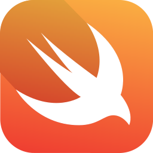

  
  <h1 align="center">Petal for macOS</h1>

  Petal is a native macOS app for fast, local-first audio transcription in a clean, minimal interface.

  
  

## Supported Models

   Whisper
  &nbsp;&nbsp;&nbsp;
   Qwen
  &nbsp;&nbsp;&nbsp;
   Voxtral
  &nbsp;&nbsp;&nbsp;
   Swift

## Deep Links

- `Petal Start`: `petal://start`
- `Petal Stop`: `petal://stop`
- `Petal Toggle`: `petal://toggle`
