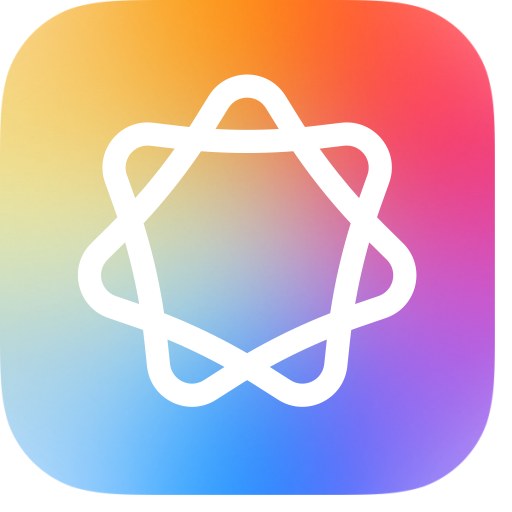
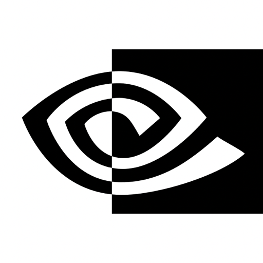

  
  <h1 align="center">Petal for macOS</h1>

  Petal is a native macOS app for fast, local-first audio transcription in a clean, minimal interface.

  
  
  

  

    
  

## Install

1. Download the latest version from the release page.
2. Open the `.dmg` and move Petal to `Applications`.
3. Launch Petal and grant microphone/accessibility permissions.

## Supported Transcription Models

<table>
  <thead>
    <tr>
      <th>Provider</th>
      <th>Model(s)</th>
      <th>Notes</th>
    </tr>
  </thead>
  <tbody>
    <tr>
      <td valign="middle"> Apple</td>
      <td>Apple Speech Transcriber (version varies by macOS)</td>
      <td>Built in on supported Macs. No model download required.</td>
    </tr>
    <tr>
      <td valign="middle"> Qwen</td>
      <td>Qwen3 ASR</td>
      <td>Default balanced on-device model.</td>
    </tr>
    <tr>
      <td valign="middle"> FluidAudio</td>
      <td>Parakeet TDT 0.6B (v3)</td>
      <td>Fast local Parakeet transcription via FluidAudio.</td>
    </tr>
    <tr>
      <td valign="middle"> Whisper</td>
      <td>Whisper Large V3, Whisper Tiny</td>
      <td>High-accuracy and lightweight Whisper options via WhisperKit.</td>
    </tr>
    <tr>
      <td valign="middle"> Voxtral</td>
      <td>Voxtral BF16, Voxtral 8-bit</td>
      <td>Fast local transcription with higher-end on-device quality.</td>
    </tr>
  </tbody>
</table>

## Features

- Multiple transcription engines, all in one native app.
- Local-first workflow designed for Apple Silicon Macs.
- Fast transcription workflow with quick copy/paste output.
- Raycast extension
  
  
  
## Privacy

Petal is designed for local transcription workflows and keeps the experience on-device where possible.

