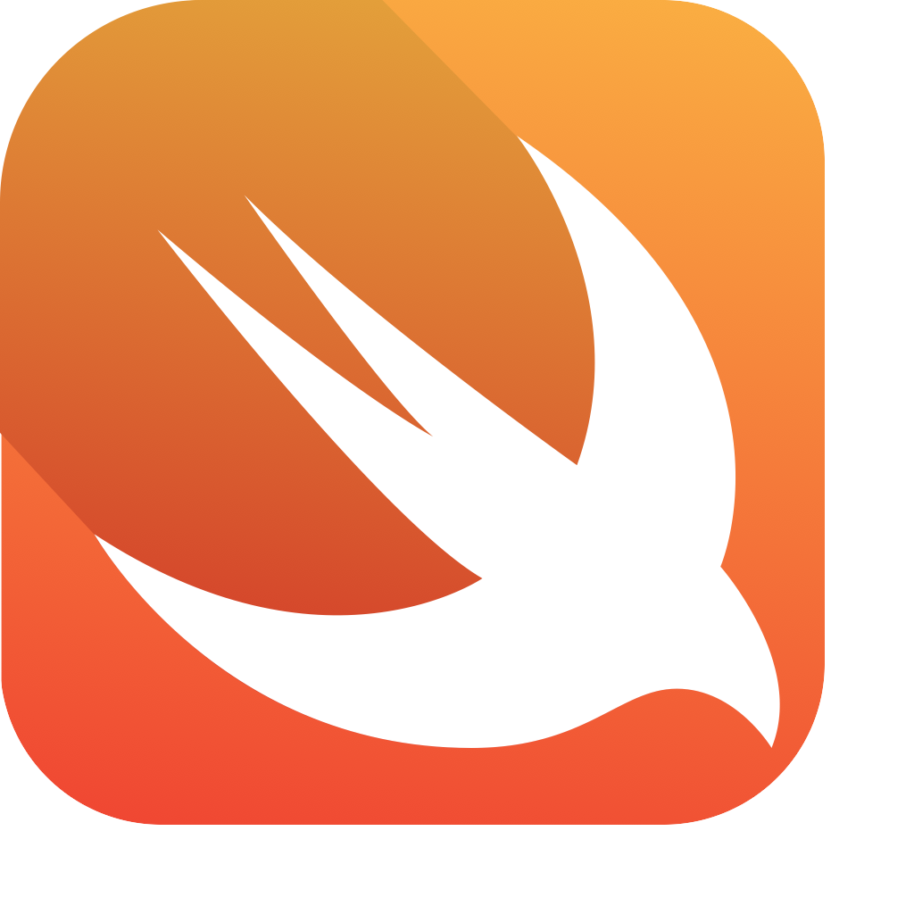

  
  <h1 align="center">Petal for macOS</h1>

  Petal is a native macOS app for fast, local-first audio transcription in a clean, minimal interface.

  

  

## Supported Models

-  **Whisper**
-  **Qwen**
-  **Voxtral**
-  **Swift**
-  **MLX**

## Why Petal

- Fast keyboard-first transcription flow.
- Local-first model support with native macOS performance.
- Clean output you can quickly copy and use anywhere.
